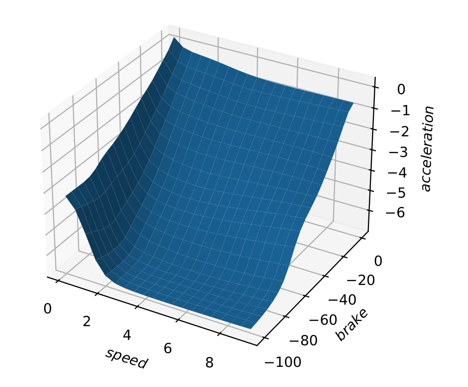
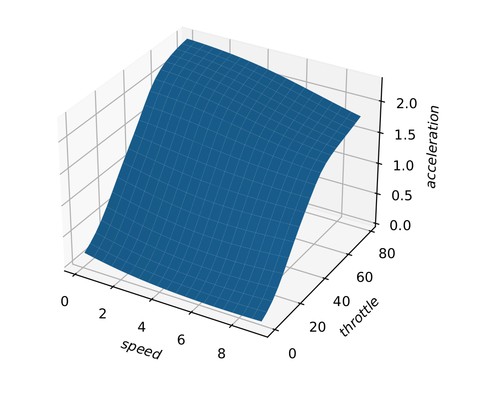
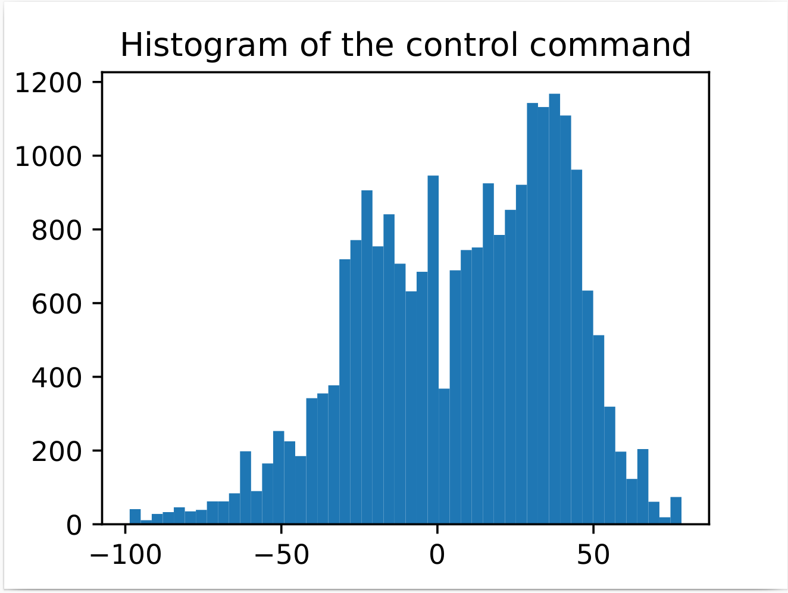
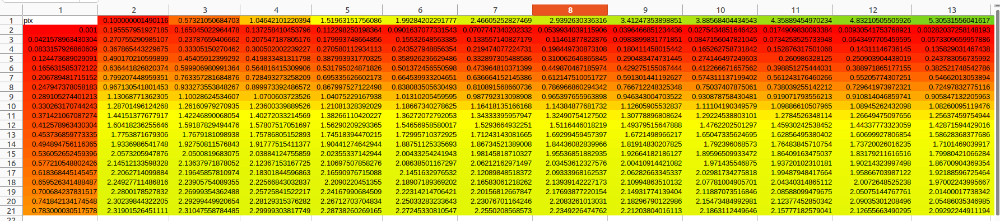
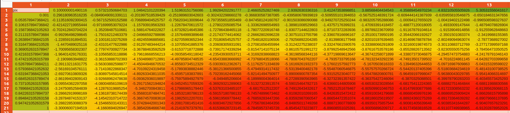

# Vehicle_dynamics_calibration
## Vehicle cloud calibration is a process that utilizes the collection of vehicle chassis throttle pedal position, brake pedal position, vehicle speed, and acceleration as inputs for the longitudinal dynamic model of the vehicle. By employing machine learning techniques, it generates the corresponding pedal calibration table for the vehicle. The generated calibration table contains a large amount of data with high precision, thereby enhancing the vehicle's control accuracy.

    

    

    

## Operation steps: Output the dynamics calibration file as a TXT, and modify parse.py to output a CSV file.

    

    

# Vehicle_dynamics_calibration
